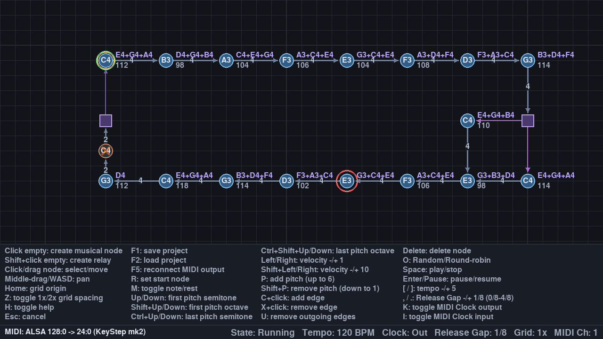

# Spatial MIDI Graph Sequencer

Spatial MIDI Graph Sequencer is a lightweight C++20 MIDI sequencer in which musical structure is drawn as a graph on a two-dimensional grid. Nodes contain MIDI pitches, edges define the time to the next node, and branches can route randomly or round-robin. Relay nodes make it possible to build timing and routing structures without producing notes of their own.

The transport is designed for **stable, accurate timing and MIDI Clock output**. Musical events are scheduled from absolute monotonic deadlines and handed to an ALSA sequencer queue with timestamps, while the transport worker sleeps between relevant deadlines to keep **CPU usage low**.

**The application does not generate audio.** Its MIDI output must be connected to a synthesizer, sampler, DAW, hardware instrument, or another MIDI destination.

For details about Note On/Off ordering, MIDI Clock, synchronization, and the Release Gap, see [MIDI.md](MIDI.md).



## Features

- Spatial graph-based sequencing on a sixteenth-note grid
- One to six pitches per musical node
- Paraphonic pitch groups: pitches in a node share the same Note On/Off gate timing
- Per-node velocity and rest state
- Random or round-robin routing at branches
- Relay nodes for zero-time routing after an incoming edge
- Internal tempo from 20 to 300 BPM
- MIDI Clock input with live handoff between internal and external timing
- Optional MIDI note entry for the selected node while playback is stopped
- Timestamped ALSA MIDI output
- JSON project save/load, including BPM and Release Gap
- Dedicated transport worker independent of rendering

## Dependencies

- Linux with ALSA Sequencer support
- C++20 compiler
- CMake 3.20 or newer
- pkg-config
- SDL2 2.0.18 or newer
- SDL2_ttf
- ALSA development library and headers

## Build

From the repository root:

```sh
cmake -S . -B build -DCMAKE_BUILD_TYPE=Release
cmake --build build -j
ctest --test-dir build --output-on-failure
```

To build and test only the graphics-independent core:

```sh
cmake -S . -B build-core \
  -DSPATIAL_MIDI_BUILD_APP=OFF \
  -DCMAKE_BUILD_TYPE=Release
cmake --build build-core -j
ctest --test-dir build-core --output-on-failure
```

## Run

Start the application with:

```sh
./build/spatial-midi --project-file examples/graph.json
```

List available ALSA MIDI output destinations and input sources:

```sh
./build/spatial-midi --list-midi
```

Select MIDI ports and other launch settings as needed:

```sh
./build/spatial-midi \
  --midi-device 128:0 \
  --midi-input-device 36:0 \
  --midi-note-input-device 36:0 \
  --midi-channel 1 \
  --midi-note-input-channel 1 \
  --default-velocity 100 \
  --project-file examples/graph.json
```

Relevant command-line options:

| Option | Meaning |
| --- | --- |
| `--list-midi` | List ALSA MIDI output and input ports, then exit |
| `--midi-device CLIENT:PORT` | Select the MIDI output destination |
| `--midi-input-device CLIENT:PORT` | Select a MIDI Clock input source |
| `--midi-note-input-device CLIENT:PORT` | Select the MIDI note-entry input source |
| `--midi-channel 1..16` | Set the MIDI output channel |
| `--midi-note-input-channel 1..16` | Set the MIDI note-entry input channel; default is 1 |
| `--default-velocity 0..127` | Set velocity for the initial graph and newly created musical nodes |
| `--project-file PATH` | Load at startup if present; use for F1/F2; default `graph.json` |
| `--font PATH` | Optional UI font override |
| `-h`, `--help` | Show command-line help |

Without an explicit output destination, the application tries the first available ALSA destination. If no destination is available, it keeps a virtual ALSA output port that can be connected later. If ALSA output itself cannot be opened, the editor continues with no-op MIDI output.

MIDI note entry is optional. Unless `--midi-note-input-device` is given, it tries to use the same ALSA port as MIDI output. If that port cannot provide input, note entry remains unavailable without affecting playback or MIDI output. F5 retries both MIDI output and note input; an implicit note-input source is resolved again from the newly connected output. While playback is stopped, a Note On on the configured note-input channel sets the selected musical node's first pitch and velocity. Other pitches in the node are preserved.

## Controls

| Input | Action |
| --- | --- |
| Left-click an empty grid position | Create and select a musical node |
| Shift+left-click an empty grid position | Create and select a relay node |
| Left-click a node | Select it |
| Left-drag a node | Move it, snapped to the grid |
| Middle-mouse drag or `W` / `A` / `S` / `D` | Pan the view |
| `Home` | Pan to graph coordinate `(0, 0)` |
| `Z` | Toggle 1x/2x grid spacing around the canvas centre |
| Up / Down | Transpose the selected node's first pitch by one semitone |
| Shift+Up / Shift+Down | Transpose its first pitch by one octave |
| Ctrl+Up / Ctrl+Down | Transpose the selected node's last pitch by one semitone |
| Ctrl+Shift+Up / Ctrl+Shift+Down | Transpose its last pitch by one octave |
| Incoming MIDI Note On while stopped | Set the selected musical node's first pitch and velocity |
| Left / Right | Decrease/increase velocity by 1 |
| Shift+Left / Shift+Right | Decrease/increase velocity by 10 |
| `P` | Add a pitch, up to six |
| Shift+`P` | Remove the last pitch, down to one |
| `C`, then left-click another node | Add a directed edge |
| `X`, then left-click another node | Remove that directed edge |
| `U` | Remove all outgoing edges from the selected node |
| `O` | Toggle Random/Round-robin routing |
| `R` | Set the selected node as the start node |
| `M` | Toggle note/rest state |
| Delete | Delete the node and attached edges |
| Space | Start playback, or stop and reset it |
| Enter / keypad Enter / Pause | Pause or resume without resetting the playhead/round-robin positions |
| `[` / `]` | Move tempo to the next lower/higher multiple of 5 BPM |
| `,` / `.` | Decrease/increase Release Gap by 1/8, from 0/8 through 4/8 |
| `K` | Toggle MIDI Clock output at a sixteenth-note boundary |
| `I` | Toggle MIDI Clock input; live handoff aligns to sixteenth-note boundaries |
| F1 | Save the project to the configured JSON file |
| F2 | Load and validate the configured JSON project, stopping current playback |
| F5 | Reconnect MIDI output and note-entry input |
| Escape | Cancel edge connect/disconnect mode |
| `H` | Toggle the help panel |

## Graph timing

Every grid step represents one sixteenth-note interval. For an ordinary edge between `(x1, y1)` and `(x2, y2)`, its duration is the Manhattan distance:

```text
ticks = abs(x2 - x1) + abs(y2 - y1)
seconds = ticks * (60 / BPM / 4)
```

An ordinary edge entering a relay consumes its normal distance. Once the relay is reached, its selected outgoing edge has zero logical duration and immediately triggers the target musical node at the same musical deadline.

Round-robin routing follows outgoing-edge creation order. Random routing selects uniformly from the outgoing edges.

## Project files

At startup, the application loads the path supplied with `--project-file` if it exists, or `graph.json` by default. F1 and F2 save to and load from the same path. Saved JSON stores the graph, BPM, and Release Gap.

A demonstration project is included as `examples/graph.json`.

## License

Licensed under the GNU General Public License version 2 only. See [LICENSE](LICENSE).
